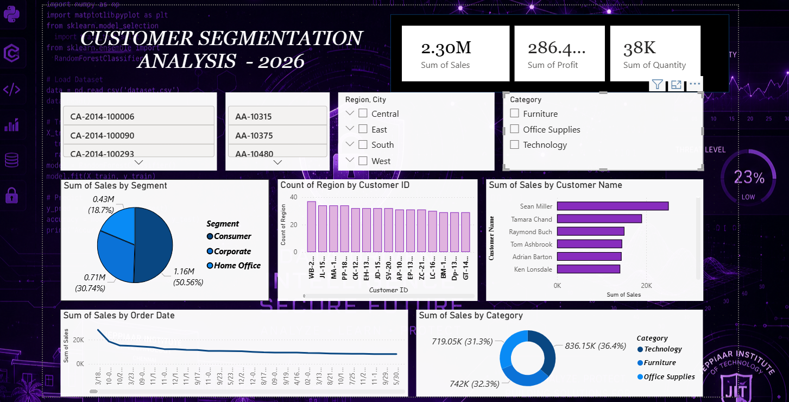

# Customer Segmentation Analysis Dashboard

A modern Power BI dashboard project developed for analyzing customer behavior, segmentation patterns, sales contribution, and category-wise performance using interactive data visualizations.

---

## 📌 Project Overview

This project focuses on customer segmentation analysis using the Superstore dataset. The dashboard provides meaningful business insights through KPI cards, charts, slicers, and interactive visuals.

---

## 🚀 Features

- Customer Segmentation Analysis
- Sales & Profit KPIs
- Region-wise Customer Distribution
- Top Customers Analysis
- Category-wise Sales Visualization
- Interactive Filters & Slicers
- Modern Cyberpunk/Violet Dashboard Theme

---

## 🛠️ Tools & Technologies Used

- Power BI Desktop
- Data Visualization
- Business Intelligence
- Data Analytics

---

## 📊 Dashboard Preview




---

## 📁 Dataset Used

- Sample Superstore Dataset

---

## 📂 Project Structure

```bash
Customer-Segmentation-Dashboard/
│
├── Customer_Segmentation_Dashboard.pbix
├── dashboard-preview.png
├── README.md
└── dataset.csv
